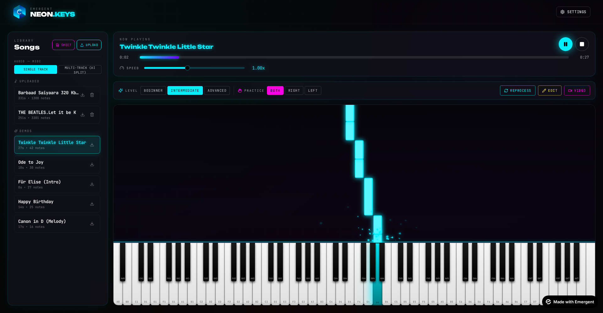
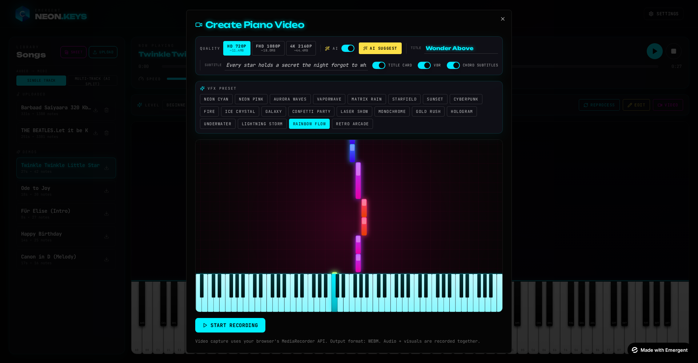

# NEON.KEYS — Piano Learning & Video Studio

<div align="center">


**A full-stack, AI-powered piano learning app that turns any audio, MIDI file, or sheet-music PDF into an interactive practice experience — then lets you export shareable 4K videos with 20 built-in VFX presets.**

</div>

---

## What is NEON.KEYS?

NEON.KEYS is a browser-based piano platform that combines three studio tools in one:

| Tool | What it does |
|------|--------------|
| **Learn** | Load a MIDI, upload an audio file (MP3/WAV/OGG), or scan sheet music (PNG/PDF). AI extracts, cleans, and hand-classifies every note. |
| **Practice** | Rolling notes fall onto an 88-key virtual piano. Filter by right/left hand, adjust tempo (0.25×–2×), see chord names, and drill difficulty tiers (Beginner / Intermediate / Advanced). |
| **Studio** | Record a video of your song with 20 neon VFX presets, per-track solo/mute, particle effects, and AI-picked title & tagline. Export in HD, FHD, or 4K. |

## Documentation Index

| Document | Purpose |
|----------|---------|
| [ARCHITECTURE.md](ARCHITECTURE.md) | System diagram, tech stack, data flow |
| [BACKEND.md](BACKEND.md) | FastAPI routes, MongoDB models, AI integrations |
| [FRONTEND.md](FRONTEND.md) | React component tree, hooks, canvas rendering |
| [FEATURES.md](FEATURES.md) | Complete feature list with screenshots |
| [USER_GUIDE.md](USER_GUIDE.md) | Step-by-step walkthroughs for every workflow |
| [API.md](API.md) | REST endpoint reference with request/response shapes |

## Quick Facts

- **Frontend**: React 19, Tailwind CSS, shadcn/ui, Tone.js (synth), TensorFlow.js + Spotify Basic Pitch (audio→MIDI), Canvas API (VFX)
- **Backend**: FastAPI, Motor (async MongoDB), `emergentintegrations` for Claude Sonnet 4.6 & Vision
- **AI**: Claude Sonnet 4.6 for MIDI cleanup, instrument classification, chord detection, sheet-music OMR, and video-preset selection
- **Data**: 88 keys (MIDI 21–108), notes as `{midi, time, duration, velocity, hand, track}`, chords as `{time, name}`

## Screenshots

<div align="center">

| Song loaded — rolling notes | Video recorder with VFX preset |
|:---:|:---:|
|  |  |

| Rainbow-flow VFX | Settings panel |
|:---:|:---:|
|  |  |

</div>

## Getting Started

```bash
# Backend
cd /app/backend
pip install -r requirements.txt
# Backend is auto-managed by supervisor; if running standalone:
uvicorn server:app --host 0.0.0.0 --port 8001

# Frontend
cd /app/frontend
yarn install
yarn start   # http://localhost:3000
```

Environment variables are already configured in `.env` files. See [ARCHITECTURE.md](ARCHITECTURE.md#environment) for details.

## Support & Contribution

- Issues / feature requests: use the chat panel inside Emergent.
- Documentation feedback: open a PR against this `docs/` folder.
