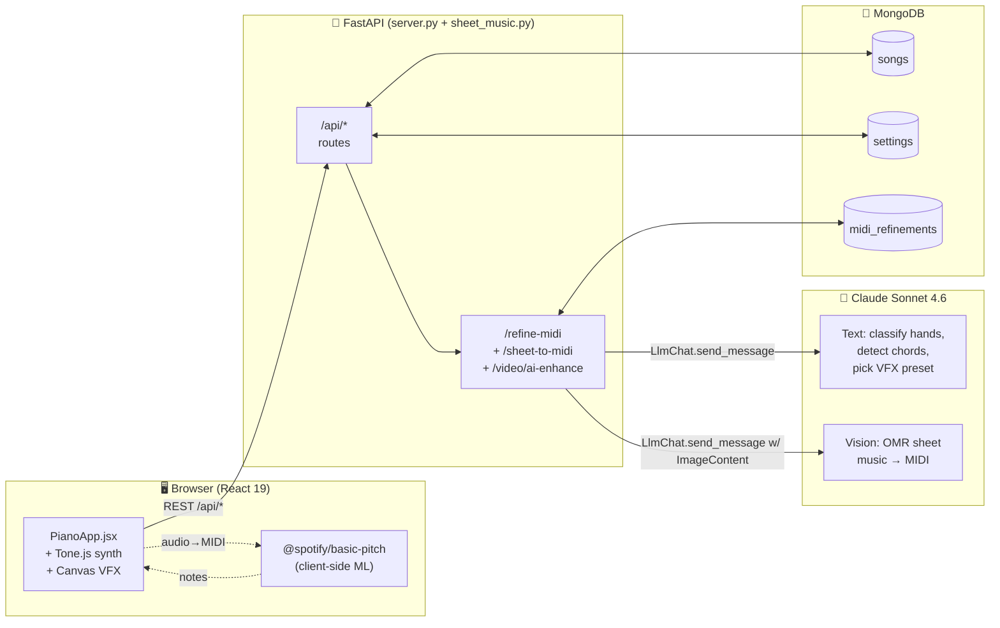
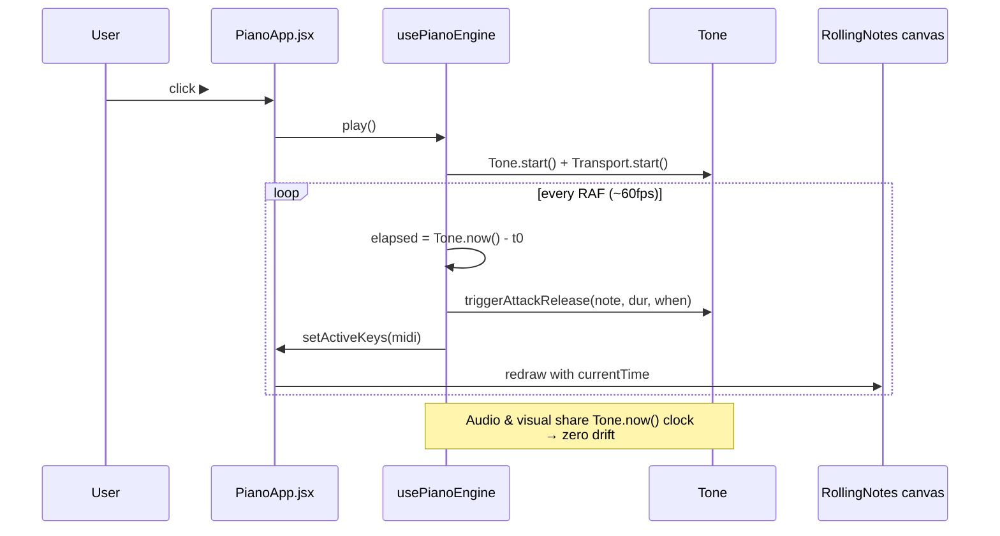
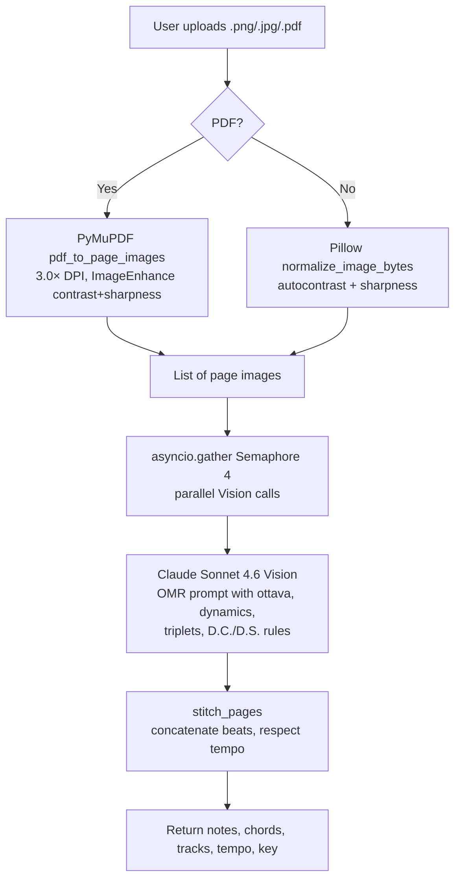

# Architecture

## System Overview

NEON.KEYS is a **three-tier full-stack app**: a React 19 SPA that talks to a FastAPI backend, which persists to MongoDB and calls Claude Sonnet 4.6 (via the emergentintegrations SDK) for all AI-heavy work.



## Tech Stack

| Layer | Technology | Version | Why |
|-------|------------|---------|-----|
| Frontend framework | React | 19 | Latest concurrent-mode, plays well with Tone.js scheduling |
| Styling | Tailwind CSS + shadcn/ui | 3.x / latest | Rapid design of neon-glass UI |
| Audio synth | Tone.js | latest | Web Audio wrapper, Salamander piano sampler, per-family instruments |
| Audio → MIDI | `@spotify/basic-pitch` + `@tensorflow/tfjs` | latest | Ships as WASM/TFJS model; runs 100% client-side |
| MIDI parsing / export | `@tonejs/midi` | latest | Read + write standard MIDI files |
| Video capture | Canvas API + MediaRecorder | native | Composite canvas → WebM/MP4 with audio track |
| Sheet-music OMR | Claude Sonnet 4.6 Vision (via emergentintegrations) | claude-sonnet-4-6 | Reads notation from images/PDFs |
| PDF rendering | PyMuPDF (fitz) | 1.28.0 | Converts PDF pages → PNG at 225 DPI |
| Image processing | Pillow | 12.3.0 | Autocontrast + sharpness for OMR |
| Backend | FastAPI | latest | Async, auto-OpenAPI, matches emergentintegrations async pattern |
| Async Mongo | Motor | latest | Non-blocking DB IO |
| LLM SDK | `emergentintegrations` | 0.2.0 | Unified Anthropic/OpenAI/Gemini client with Emergent universal key |

## Environment

### Backend (`/app/backend/.env`)

| Var | Purpose |
|-----|---------|
| `MONGO_URL` | MongoDB connection string (local by default) |
| `DB_NAME` | Database name |
| `EMERGENT_LLM_KEY` | Universal LLM key — works with Claude, GPT, Gemini |
| `CORS_ORIGINS` | Comma-separated allow-list (default `*` in dev) |

### Frontend (`/app/frontend/.env`)

| Var | Purpose |
|-----|---------|
| `REACT_APP_BACKEND_URL` | External backend URL — all API calls prefix `/api` onto this |
| `WDS_SOCKET_PORT` | Webpack dev-server socket port (443 for Kubernetes ingress) |

## Directory Layout

```text
/app/
├── backend/
│   ├── server.py            # Main FastAPI app — routes for songs, settings, refine-midi, video/ai-enhance
│   ├── sheet_music.py       # OMR helpers: pdf_to_page_images, normalize_image_bytes, sheet_page_to_notes, stitch_pages
│   ├── requirements.txt     # Python deps (motor, pymupdf, pillow, emergentintegrations, …)
│   ├── tests/               # pytest — 18 checks
│   └── .env
├── frontend/
│   ├── public/
│   │   ├── logo.png                    # NEON.KEYS hexagonal logo
│   │   └── basic-pitch-model/          # TFJS model files served statically
│   ├── src/
│   │   ├── App.js
│   │   ├── components/
│   │   │   ├── PianoApp.jsx            # Root shell — hosts layout, wires all sub-components
│   │   │   ├── PianoKeyboard.jsx       # 88-key SVG piano
│   │   │   ├── RollingNotes.jsx        # Canvas-drawn notes falling to piano
│   │   │   ├── SongLibrary.jsx         # Left-rail: uploads, demos, MIDI download
│   │   │   ├── TransportControls.jsx   # Play / pause / seek / speed
│   │   │   ├── SettingsPanel.jsx       # Right-side sheet: volume, colors, chord tutorial
│   │   │   ├── ToolBar.jsx             # Practice/difficulty/edit/video buttons
│   │   │   ├── MidiEditor.jsx          # Note overlay + resize handles + shift toolbar
│   │   │   ├── ChordTutorial.jsx       # Floating chord shape overlay
│   │   │   ├── ChordStrip.jsx          # Timeline chord bar
│   │   │   ├── TrackPianoStack.jsx     # Stacked mini-pianos below main
│   │   │   └── VideoRecorderModal.jsx  # 4K/FHD/HD export with VFX + track mixer
│   │   ├── hooks/
│   │   │   └── usePianoEngine.js       # Tone.js scheduling + active-keys state
│   │   └── lib/
│   │       ├── piano.js                # KEYS array (MIDI 21–108), name helpers
│   │       ├── midiParse.js            # MIDI file → app song shape
│   │       ├── midiExport.js           # App song → .mid download
│   │       ├── audioToMidi.js          # Basic Pitch client-side extraction
│   │       ├── chordParser.js          # Chord-name → MIDI-set (Cmaj → [60,64,67])
│   │       ├── instruments.js          # Family → Tone.js instrument mapping
│   │       ├── vfx.js                  # 20 VFX presets + drawBackground/Note/Piano
│   │       ├── videoFrameRenderer.js   # renderFrame() composed for recorder
│   │       └── videoRecorder.js        # MediaRecorder wrapper w/ VBR support
│   └── .env
├── docs/                    # ← YOU ARE HERE
└── memory/PRD.md            # Living product doc + changelog
```

## Playback Pipeline



## Audio → MIDI Flow

```mermaid
flowchart TD
    A[User uploads .mp3 / .wav] --> B[AudioContext decodeAudioData]
    B --> C[Downsample to 22050 Hz mono]
    C --> D[@spotify/basic-pitch<br/>ML inference in browser]
    D --> E[Raw notes<br/>{midi,time,duration,velocity}]
    E --> F{convertMode?}
    F -- single --> G[POST /api/refine-midi<br/>multi_track: false]
    F -- multi --> H[POST /api/refine-midi<br/>multi_track: true]
    G --> I[Claude cleans + classifies hands + detects chords]
    H --> J[Claude also splits into 5 instrument roles<br/>melody/harmony/bass/pad/accent]
    I --> K[POST /api/songs → MongoDB]
    J --> K
    K --> L[Song appears in Library, ready to play]
```

## Sheet Music → MIDI Flow



## Data Model (MongoDB)

| Collection | Fields | Notes |
|------------|--------|-------|
| `songs` | `id, name, duration, notes[], chords[], tracks[], difficulty, source, created_at` | `notes` items = `{midi, time, duration, velocity, hand, track}`. `tracks` items = `{id, name, family, program, isDrum, notes}` |
| `settings` | `id="global", volume, speed, show_labels, note_color, sustain, lookahead, convert_mode, chord_tutorial` | Single-row doc. Frontend hydrates on mount and debounces PUTs. |
| `midi_refinements` | `key (sha256), notes, chords, tracks, stats, created_at` | Cache. Hash includes MIDI + difficulty + multi_track flag. |

## Key Design Decisions

- **Tone.now() as master clock**. Both audio scheduling and visual RAF loops derive `elapsed` from the audio-context timestamp so they never drift under GC pauses.
- **Vision AI over dedicated OMR services**. Claude Sonnet 4.6 Vision now handles sheet-music OMR well enough that we skip Audiveris/Verovio and stay in one AI vendor.
- **Client-side audio→MIDI**. Running Basic Pitch in the browser keeps audio files off the server (privacy + zero server compute cost).
- **Universal LLM key**. All AI calls go through `EMERGENT_LLM_KEY` — no per-vendor account setup.
- **VBR for 4K**. MediaRecorder's `bitrateMode: 'variable'` hint + 60% target bitrate keeps 4K files 40% smaller with no perceptible quality loss for piano visualizations (flat-color-heavy scenes).
