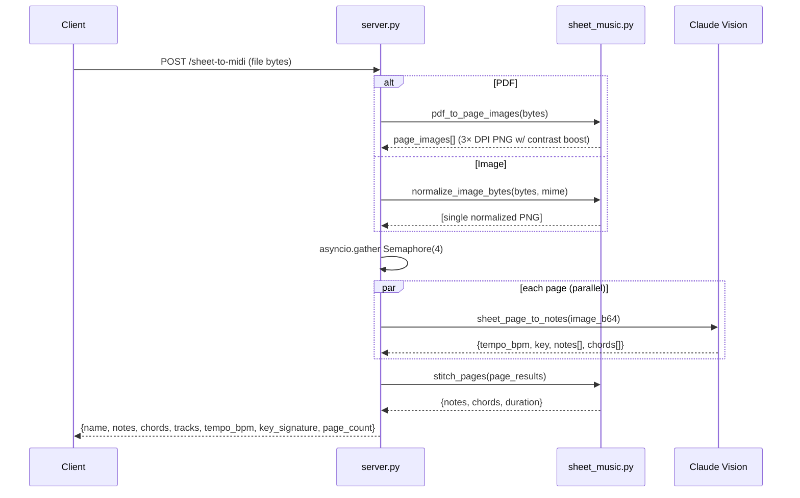

# Backend Reference

`/app/backend/server.py` (main API) + `/app/backend/sheet_music.py` (OMR helpers).

## Startup & Configuration

```python
# server.py — key setup
load_dotenv(ROOT_DIR / '.env')
client = AsyncIOMotorClient(os.environ['MONGO_URL'])
db = client[os.environ['DB_NAME']]

app = FastAPI()
api_router = APIRouter(prefix="/api")   # ALL routes MUST live under /api
app.include_router(api_router)
app.add_middleware(CORSMiddleware, allow_origins=CORS_ORIGINS, ...)

EMERGENT_LLM_KEY = os.environ.get('EMERGENT_LLM_KEY')
```

Rule of thumb: every new route goes on `api_router`, not `app`, so Kubernetes ingress routes `/api/*` to backend port 8001.

## Pydantic Models

```python
class Note(BaseModel):
    midi: int                        # 21–108
    time: float                      # start seconds
    duration: float                  # seconds
    velocity: float = 0.8            # 0..1
    hand: Optional[str] = None       # 'left' | 'right'
    track: Optional[int] = None      # 0-based track index for multi-track

class Song(BaseModel):
    id: str = Field(default_factory=lambda: str(uuid.uuid4()))
    name: str
    duration: float
    notes: List[Note]
    chords: List[Any] = []
    tracks: List[Any] = []
    difficulty: str = "intermediate"
    source: str = "upload"           # upload | audio | sheet | edit
    created_at: str = Field(default_factory=lambda: datetime.now(timezone.utc).isoformat())

class Settings(BaseModel):
    id: str = "global"
    volume: float = 0.8
    speed: float = 1.0
    show_labels: bool = True
    note_color: str = "cyan"
    sustain: bool = False
    lookahead: float = 4.0
    convert_mode: str = "single"     # 'single' | 'multi'
    chord_tutorial: bool = True

class RefineRequest(BaseModel):
    notes: List[Note]
    name: Optional[str] = None
    difficulty: str = "intermediate"
    force_refresh: bool = False
    multi_track: bool = False        # ← when true, LLM splits into 5 instruments
```

## Route Catalog

| Method | Route | Purpose | Key body / response |
|--------|-------|---------|---------------------|
| GET | `/api/` | Healthcheck | `{message, status: 'ok'}` |
| GET | `/api/demo-songs` | Static demo library | `Song[]` |
| GET | `/api/songs` | List user songs | `Song[]` (newest first) |
| POST | `/api/songs` | Save new song | Body: `Song`. Returns saved doc. |
| PUT | `/api/songs/{id}` | Update notes only | Body: `{notes: Note[]}`. |
| DELETE | `/api/songs/{id}` | Remove song | `{deleted: true}` |
| GET | `/api/settings` | Read global settings | `Settings` |
| PUT | `/api/settings` | Persist settings | Body: `Settings`. Idempotent upsert. |
| POST | `/api/refine-midi` | AI cleanup + hand classification (+ optional multi-track split) | See below |
| POST | `/api/sheet-to-midi` | OMR: image or PDF → MIDI | See below |
| POST | `/api/video/ai-enhance` | Pick VFX preset + generate title/tagline | See below |

## `/api/refine-midi`

**Request**
```json
{
  "notes": [{ "midi": 60, "time": 0, "duration": 0.5, "velocity": 0.9 }, ...],
  "name": "Twinkle",
  "difficulty": "intermediate",
  "force_refresh": false,
  "multi_track": true
}
```

**What happens**
1. `_refine_cache_key(notes, difficulty, multi_track)` → sha256; if cached, return immediately.
2. Notes go to Claude Sonnet 4.6 via `_classify_hands(notes, difficulty, multi_track)`.
3. Claude returns `{right:[idx], left:[idx], drop:[idx], chords:[{time,name}], tracks?:{melody,harmony,bass,pad,accent}}`.
4. Backend maps track buckets → rich track objects using `TRACK_ROLE_MAP`:
    | Role | family | program | color |
    |------|--------|---------|-------|
    | melody | piano | 0 | #00F0FF |
    | harmony | strings | 48 | #7CFF9A |
    | bass | bass | 32 | #FF00E6 |
    | pad | synthPad | 88 | #B388FF |
    | accent | synthLead | 80 | #FFD700 |
5. If < 2 tracks produced, fall back to hand-based Melody+Bass split.
6. Cache result in `midi_refinements`.

**Response**
```json
{
  "notes": [...],
  "chords": [{"time": 0.5, "name": "Cmaj"}, ...],
  "tracks": [
    {"id":"t0","name":"Melody","family":"piano","program":0,"isDrum":false,"notes":[...]},
    {"id":"t1","name":"Bass","family":"bass","program":32,"isDrum":false,"notes":[...]}
  ],
  "stats": {"input": 320, "output": 285, "dropped": 35, "refined": true, "difficulty": "intermediate", "multi_track": true, "track_count": 2, "cached": false}
}
```

## `/api/sheet-to-midi`

Accepts `multipart/form-data` with one `file` field (PNG / JPG / WEBP / PDF).



The system prompt (`sheet_music.py:SHEET_MUSIC_SYSTEM`) explicitly covers:

- Treble → right, bass → left hand assignment
- Key signature + accidental scoping
- Note durations including triplets, dotted values, ties
- Ottava markings (`8va`/`8vb`/`15ma`)
- Repeats + 1st/2nd endings + D.C./D.S. expansion (flatten to linear timeline)
- Dynamics → velocity mapping (ppp=0.35 … fff=1.0)
- Grace notes, accents, staccato

## `/api/video/ai-enhance`

**Request**
```json
{
  "song_name": "Let It Be",
  "duration": 245,
  "note_count": 812,
  "chord_names": ["C", "G", "Am", "F"],
  "families": ["piano", "bass"],
  "available_presets": ["neon-cyan", "fire", "aurora", ...]
}
```

**Response**
```json
{
  "preset_id": "aurora",
  "title": "Let It Be",
  "tagline": "Whispers on a stormy night",
  "mood": "melancholic"
}
```

## Sheet Music Module — Function Reference

| Function | Purpose |
|----------|---------|
| `pdf_to_page_images(bytes)` | Render each PDF page at 3× DPI, apply contrast + sharpness enhancement, cap longest side at 2400px, return list of PNG bytes. |
| `_enhance_for_omr(img)` | Pillow `ImageOps.autocontrast` + `ImageEnhance.Contrast(1.35)` + `ImageEnhance.Sharpness(1.5)`. |
| `normalize_image_bytes(bytes, mime)` | Ensure PNG/JPEG/WEBP, transcode + enhance. Returns `(bytes, mime)`. |
| `sheet_page_to_notes(bytes, mime, page_idx, api_key, extract_json)` | Base64-encode image → Claude Vision with system prompt → parse JSON. |
| `stitch_pages(pages)` | Concatenate per-page beat-timed notes onto one absolute timeline using the first page's tempo. Also stitches chord markers. |

## Testing

```bash
cd /app/backend
pytest tests/ -v
```

Current suite: **18 test cases** covering demo-songs, songs CRUD, refine-midi single/multi/cache-key/fallback, sheet-to-midi variants (empty, corrupt, PDF, PNG), video ai-enhance, and settings roundtrip with `convert_mode` + `chord_tutorial`.
