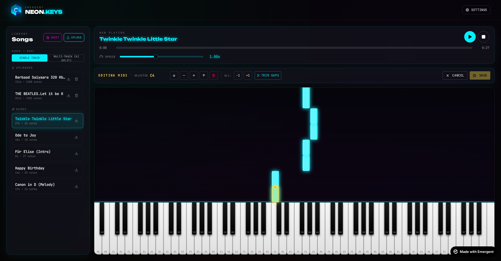
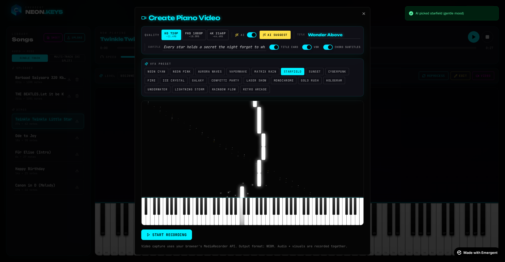
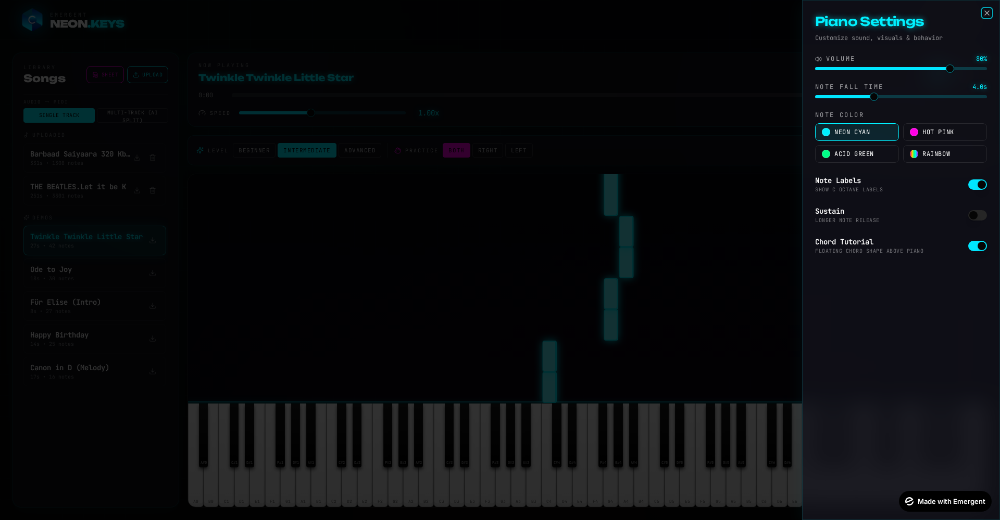

# Features

## Learn

### 1. MIDI Upload
Drop any `.mid` / `.midi` file into the Song Library — `@tonejs/midi` parses it into the app's canonical `{midi, time, duration, velocity}` shape and it's playable immediately.

### 2. Audio → MIDI (Client-side ML)
Upload `.mp3` / `.wav` / `.ogg` / `.m4a` / `.flac`. `@spotify/basic-pitch` runs a TensorFlow.js model **in the browser** — no audio ever leaves the user's device. Progress is streamed as `decoding → analyzing → converting → done`.

### 3. Sheet Music → MIDI (Vision AI)
Upload a `.png`, `.jpg`, `.webp`, or **multi-page `.pdf`** of piano notation. The backend:

1. Renders each PDF page at 3× DPI (≈225 DPI) using PyMuPDF.
2. Runs Pillow autocontrast + sharpness enhancement.
3. Sends each page (base64) to Claude Sonnet 4.6 Vision in parallel (4 concurrent).
4. Applies a strict OMR system prompt covering clefs, key/time signatures, ottava, triplets, ties, dynamics → velocity, D.C./D.S. expansion, chord detection.
5. Stitches pages together and returns notes + chords + tracks.

### 4. AI Refinement
Every audio-derived song runs through `POST /api/refine-midi`:

- Classifies notes into `right` / `left` hand
- Drops likely mis-detections
- Detects the chord progression as `{time, name}` pairs
- Applies difficulty tier (Beginner drops complex chords; Advanced keeps everything)
- Optionally splits into up to 5 instrument tracks (melody / harmony / bass / pad / accent)

Results are cached by SHA-256 hash so re-uploads / difficulty changes are instant.

## Practice

### 5. Rolling Notes
Canvas-drawn falling notes with a 4-second lookahead. Left/right hand distinct colors; multi-track uses per-track palettes.

### 6. Practice Modes
| Mode | Effect |
|------|--------|
| Both | All notes play |
| Right | Only right-hand notes play (left-hand muted) |
| Left | Only left-hand notes play |

Great for isolating one hand while learning.

### 7. Difficulty Tiers

| Tier | Behavior |
|------|----------|
| Beginner | Simplified — sparse melody, primary chord tones, slower default speed |
| Intermediate | Balanced default |
| Advanced | Everything — dense runs, ornaments, complete voicings |

Switching difficulty triggers a re-run of `/refine-midi` (cached, so subsequent switches are instant).

### 8. Chord Tutorial
Toggleable floating overlay (Settings → Chord Tutorial) that shows the currently-playing chord's name and a mini 2-octave keyboard with the chord tones highlighted. Includes a **Play** button that arpeggiates the chord so you can hear it before attempting.

### 9. Chord Timeline Strip
Bottom-bar chord strip showing chord names positioned along the song timeline.

### 10. Playback Controls
Play / pause / stop / seek + speed slider (0.25× – 2×).

## Compose

### 11. MIDI Editor (Note Editing)

Click **EDIT** in the toolbar to overlay every note as a clickable button:

| Action | How |
|--------|-----|
| Select a note | Click it |
| Shift ± semitone | ← / → |
| Shift ± octave | ↑ / ↓ |
| Delete | Del / Backspace |
| **Resize** | Drag the yellow handle at the top edge of a selected note — up = longer, down = shorter |
| Shift all notes | Toolbar `−1` / `+1` buttons |
| **Trim silent gaps** | Toolbar `Trim Gaps` button — sweeps the timeline and pulls notes back to eliminate any silent stretch > 0.3s (keeps 0.15s minimum) |
| Save | Saves in-place for user songs, or as `{name} (edited)` for demo songs |

## Studio (Video Export)

### 12. Video Recorder
Composites the canvas + Tone audio destination via `MediaRecorder`. Produces WebM or MP4 with sync audio.

### 13. Resolutions
| Preset | Dimensions | FPS | Bitrate | Typical size (1min) |
|--------|-----------|-----|---------|---------------------|
| HD 720p | 1280×720 | 30 | 5 Mbps | ~40 MB |
| FHD 1080p | 1920×1080 | 30 | 8 Mbps | ~65 MB |
| 4K 2160p | 3840×2160 | 24 | 20 Mbps | ~155 MB (~92 MB with VBR) |

### 14. VBR Toggle
When ON, MediaRecorder uses `bitrateMode: 'variable'` + 60% target bitrate. Piano visualizations (heavy on flat color) compress ~40% smaller with no visible quality loss.

### 15. 20 VFX Presets

Neon Cyan · Neon Pink · Aurora Waves · Vaporwave · Matrix Rain · Starfield · Sunset · Cyberpunk · Fire · Ice Crystal · Galaxy · Confetti Party · Laser Show · Monochrome · Gold Rush · Hologram · Underwater · Lightning Storm · **Rainbow Flow** · Retro Arcade

**Rainbow Flow** now uses per-pitch chromatic hue rotation with time-based drift so each pitch class gets a distinct color that animates across the palette while playing.

### 16. AI Enhancer

Toggle in the recorder — when ON, Claude auto-picks the best VFX preset for the song's mood + tempo + chord progression, and generates a title + tagline. Editable text inputs (`data-testid='video-title-input'`, `data-testid='video-subtitle-input'`) let you tweak the AI output or write your own.

### 17. Track Mixer (Multi-track Songs)
For songs with 2+ non-drum tracks, a Track Mixer panel appears showing each track with **S** (solo) and **M** (mute) buttons. Muted tracks are filtered out of both audio and visual. Reset button clears everything.

### 18. Stacked Mini-Pianos in Video
When recording a multi-track song, the video canvas splits the piano region into a main piano + up to 4 stacked mini pianos below, each showing that track's active notes in the track's color.

### 19. Live Particle VFX in Preview
The preview canvas isn't static — particles fire in real time whenever a note triggers, using the current preset's color and particle style.

### 20. Chord Subtitles in Video
Toggleable — burns the current chord name onto the bottom center of the exported video.

### 21. Title Card Intro
2.5-second intro card with the song title, tagline, and neon underline animation before the piano playback starts.

## Data & Import/Export

### 22. Song Library
Left-rail library shows:
- Your uploaded songs (persisted to MongoDB, per-song delete button)
- Curated demo songs
- Per-song **Download** icon → exports the current song as a standard `.mid` file via `@tonejs/midi`

### 23. Convert Mode Toggle
Single Track vs Multi-Track (AI Split) — persisted in Settings.convert_mode so your preference sticks across sessions.

## Personalization

### 24. Settings Panel
- **Volume** — 0–100%
- **Note Fall Time** — 2s–8s lookahead
- **Note Color** — Cyan, Hot Pink, Acid Green, Rainbow
- **Note Labels** — show/hide C-octave labels on the piano
- **Sustain** — longer note release for legato playback
- **Chord Tutorial** — floating chord shape overlay on/off

Everything persists to `/api/settings` (debounced 500ms).

## Under the Hood

- **Video/audio zero-drift sync** — audio pre-scheduled with `Tone.now()`; visual RAF loop derives elapsed from the same audio clock.
- **Note.track model field** — user-uploaded multi-track songs preserve track assignments end-to-end.
- **Refinement cache** — SHA-256 keyed by (notes + difficulty + multi_track); no re-billing when users tweak settings.
- **Playable + aligned stacked pianos** — each mini piano supports click-to-play with its track's instrument family.
