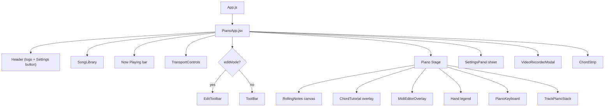

# Frontend Reference

React 19 SPA under `/app/frontend/src`. All state lives in `PianoApp.jsx`; the `usePianoEngine` hook owns the Tone.js audio graph.

## Component Tree



## Root Container — `PianoApp.jsx`

Owns most app state:

| State | Purpose |
|-------|---------|
| `demoSongs`, `userSongs`, `currentSong` | Library + selected song |
| `settings` | Volume, speed, note-color, chord tutorial, etc. — synced with `/api/settings` |
| `convertMode` | `'single'` or `'multi'` for audio uploads — persisted via settings.convert_mode |
| `editMode`, `selectedNoteIdx`, `editSnapshot` | MIDI editing session |
| `converting` | `{stage, percent, kind: 'audio'|'sheet'}` progress indicator |
| `videoOpen` | Toggles the recording modal |
| `trackColors`, `mutedTracks`, `soloedTrack` | Multi-track visualization state |

Key callbacks (all `useCallback`):

- `handleUpload(file, isAudio)` — pipes audio → basic-pitch → `/refine-midi` → save; MIDI files go through `parseMidiFile` first.
- `handleUploadSheet(file)` — posts to `/sheet-to-midi`.
- `handleDownloadMidi(song)` — uses `midiExport.downloadSongAsMidi`.
- `resizeNote(idx, dur)` — clamped `[0.05, 30]`, extends song duration if needed.
- `compressGaps()` — removes silent gaps > 0.3s from the timeline.
- `shiftNote`, `deleteSelectedNote`, `globalShift`, `saveEdits`.

## Playback Engine — `usePianoEngine.js`

```js
const engine = usePianoEngine(currentSong, {
  volume: 0.8,
  speed: 1.0,
  sustain: false,
  practiceMode: 'both',     // 'both' | 'right' | 'left'
  onNoteStart: (midi, hand) => {},
});
// engine.play(), engine.pause(), engine.stop(), engine.seek(t)
// engine.playNote(midi, dur, vel, family)  // manual key press
// engine.activeKeys — Map<midi, {hand, track}>
// engine.currentTime — updated via RAF from Tone.now()
```

Internals:

1. Loads Salamander piano sampler + per-family instruments (`bass`, `strings`, `synthPad`, `synthLead`, `drums`) on first play via `instruments.js`.
2. On `play()`, calls `Tone.start()`, sets `playStartRef = Tone.now()`, uses RAF loop to:
   - Compute `currentTime = Tone.now() - playStartRef`
   - Scan notes; call `triggerAttackRelease(noteName, dur, when, velocity)` where `when` is an absolute audio-context time
   - Update `activeKeys` Map for visual feedback
3. Practice-mode filter: skips notes whose `hand` doesn't match the current mode.

## Rolling Notes — `RollingNotes.jsx`

Canvas-based rendering (60 fps):

- Each frame: iterate `song.notes`, compute `relStart = n.time - currentTime`, only draw notes with `-1 < relStart < lookahead`.
- Notes are stacked vertically, falling toward `NOTES_H` (the piano top).
- Left/right hand colored differently.
- Multi-track colors use `trackColors[trackId]` override.

## Chord Tutorial — `ChordTutorial.jsx`

```mermaid
flowchart TD
    A[chords: '{time, name}[]'] -->|find latest name where time <= currentTime| B{name changed?}
    B -- no --> Z[no-op]
    B -- yes --> C[chordNameToMidi -> '[60,64,67]']
    C --> D[Render pill + mini keyboard]
    D --> E[Highlight chordSet keys in noteColor]
    D --> F[Play button -> onPlay midis]
```

## Chord Parser — `lib/chordParser.js`

Supports: `maj`, `m`/`min`, `dim`, `aug`, `sus2`, `sus4`, `6`, `7`, `maj7`/`M7`, `m7`, `dim7`, `m7b5`, `7b5`, `7#5`, `9`, `maj9`, `m9`, `add9`, `11`, `13`, slash chords (`Xchord/Y`).

Test cases you can rely on:

| Input | Output MIDI |
|-------|-------------|
| `Cmaj` | `[60, 64, 67]` |
| `Am` | `[57, 60, 64]` |
| `G7` | `[55, 59, 62, 65]` |
| `Dm7` | `[62, 65, 69, 72]` |
| `F/A` | `[45, 65, 69, 72]` (A bass below F chord) |
| `Csus4` | `[60, 65, 67]` |

## MIDI Editor — `MidiEditor.jsx`

`MidiEditorOverlay` renders one `<button>` per visible note ON TOP of the RollingNotes canvas. When a note is selected:

- Yellow border + glow
- A resize handle (data-testid `resize-handle-{idx}`) appears at the top edge
- Drag up → longer note, drag down → shorter (clamped to `[0.05, 30]`)

`EditToolbar` provides:

| Action | Keyboard | Callback |
|--------|----------|----------|
| Shift selected -1 semitone | ← | `onShift(-1)` |
| Shift selected +1 semitone | → | `onShift(1)` |
| Shift selected -1 octave | ↓ | `onShift(-12)` |
| Shift selected +1 octave | ↑ | `onShift(12)` |
| Delete selected | Del / Backspace | `onDelete()` |
| Shift ALL notes -1 semitone | — | `onGlobalShift(-1)` |
| Shift ALL notes +1 semitone | — | `onGlobalShift(1)` |
| Trim silent gaps | — | `onCompressGaps()` |
| Save changes | — | `onSave()` |

## Video Recorder — `VideoRecorderModal.jsx`

```mermaid
flowchart TD
    Open[Modal opens] --> AIauto{aiEnabled?}
    AIauto -- yes, first time --> AI[POST /api/video/ai-enhance]
    AI --> Prefill[Set preset + title + tagline]
    Open --> Preview[Preview RAF loop]
    Preview --> Ren[videoFrameRenderer.renderFrame]
    Ren --> Canvas[Canvas 1280×720 default]
    User[User clicks Start] --> Prep[createVideoRecorder<br/>MediaRecorder + audio track]
    Prep --> PreSched[Pre-schedule ALL notes at<br/>Tone.now() + n.time]
    PreSched --> RecLoop[RAF: update activeKeys<br/>+ spawnParticles<br/>+ renderFrame]
    RecLoop --> Stop{elapsed >= duration?}
    Stop -- yes --> Blob[recorder.stop → Blob]
    Blob --> DL[Download button]
```

**Track Mixer** (only visible when `song.tracks.length > 1`) —
- `visibleSong` memo filters `song.notes` and `song.tracks` by mute/solo state
- Both preview and recording use `visibleSong`, so muted tracks are silent AND invisible

**VBR toggle** — when ON, `createVideoRecorder` receives `bitrateMode: 'variable'` + target 60% of stated bitrate. File-size estimate on each resolution button updates in real time.

**Editable title + subtitle** — `videoTitle` and `aiTagline` inputs feed the title-card render and the downloaded filename.

## VFX Presets — `lib/vfx.js`

20 presets, each defines:

| Field | Values |
|-------|--------|
| `bg` | grid \| aurora \| vapor \| matrix \| starfield \| sunset \| plain \| storm |
| `note` | glow \| gradient \| solid \| rainbow |
| `particle` | burst \| ring \| sparks |
| `keyFx` | glow \| pulse |
| `chromatic` | boolean (chromatic aberration on the whole frame) |
| `beatShake` | 0..1 — translational shake when keys hit |
| `palette` | array of hex colors (or `["rainbow"]`) |
| `trails` | boolean — motion-blur particles |
| `chromaDepth` | 0..1 — depth of the RGB offset overlay |
| `pulseGlow` | 0..1 — soft bloom on the impact line when 2+ keys hit |

All zoom-on-beat is removed. `pulseGlow` replaces it with a cleaner white/palette bloom.

## Hooks & Utilities Summary

| File | Purpose |
|------|---------|
| `hooks/usePianoEngine.js` | Tone.js scheduling + active-keys state |
| `lib/piano.js` | `KEYS` (MIDI 21–108), `midiToNoteName`, `isBlackKey` |
| `lib/midiParse.js` | `parseMidiFile(file)` — reads .mid via `@tonejs/midi` |
| `lib/midiExport.js` | `downloadSongAsMidi(song)` — serializes song → .mid Blob → browser download |
| `lib/audioToMidi.js` | `convertAudioToMidi(file, onProgress)` — Basic Pitch client-side |
| `lib/chordParser.js` | Chord name → MIDI-set + `chordDisplayName` |
| `lib/instruments.js` | `FAMILY_COLORS`, family → Tone instrument factory |
| `lib/vfx.js` | Presets, `drawBackground`, `drawNote`, `drawPiano`, `spawnParticles`, `updateParticles`, `drawParticles`, `hexA`, `keyXFractionCanvas` |
| `lib/videoFrameRenderer.js` | `renderFrame(ctx, preset, timeAbs, currentTime, song, activeKeys, particles, overlay, dims)` — composes one full frame including stacked mini-pianos |
| `lib/videoRecorder.js` | `createVideoRecorder(canvas, opts)` — MediaRecorder + Tone audio-destination stream |

## data-testid Conventions

All interactive elements have a stable `data-testid`. Common patterns:

| Pattern | Example |
|---------|---------|
| `song-row-{id}` | Song list rows |
| `download-midi-{id}` | Per-song MIDI download button |
| `vfx-preset-{id}` | VFX preset buttons in modal |
| `edit-note-{idx}` | Editor note overlay |
| `resize-handle-{idx}` | Editor resize grabber (only on selected) |
| `track-mixer-row-{tid}`, `track-solo-{tid}`, `track-mute-{tid}` | Video track mixer |
| `chord-tutorial-overlay`, `chord-tutorial-play`, `chord-tutorial-name` | Chord tutorial |
