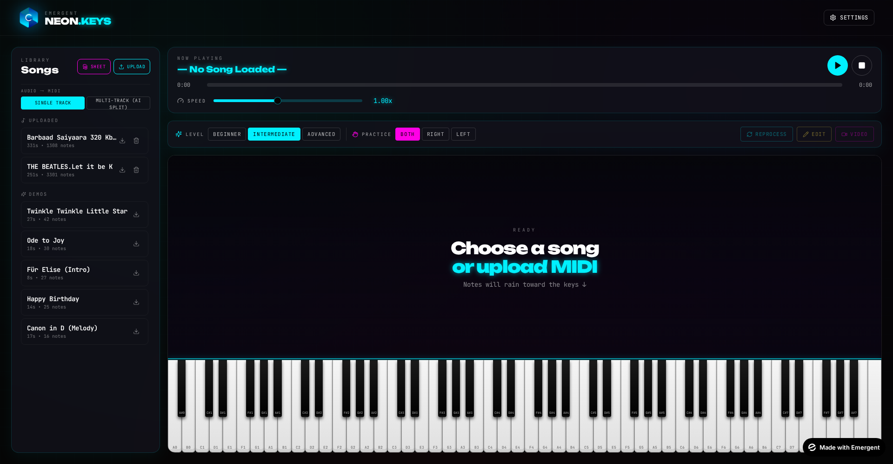

# User Guide

Step-by-step walkthroughs for every core workflow.

## 1. First Launch

On first launch you'll see:
- The neon logo top-left.
- A **Songs library** on the left with two upload buttons (**Sheet** for images/PDFs, **Upload** for MIDI/audio) and a scrollable list of curated demo tracks.
- A large **Now Playing** area waiting for you to pick or upload a song.
- A full 88-key **virtual piano** at the bottom that responds to clicks.

Click **Settings** (top-right) at any time to tweak the volume, note color, chord tutorial, sustain, and other personal preferences.

## 2. Loading a Song

Three ways to load music:

### From the demo library
Click any demo song in the left rail. It loads instantly, and the toolbar reveals **Play / Pause**, **Practice**, **Difficulty**, **Video**, and **Edit** controls.

### From a MIDI file
Click **Upload**, choose a `.mid` or `.midi` file. Loads immediately without AI processing.

### From an audio file (MP3/WAV/OGG/M4A/FLAC)
1. Click **Upload** → pick your audio.
2. Choose **Single Track** or **Multi-Track (AI Split)** in the library header before uploading.
3. A progress bar tracks:
    - Decoding audio →
    - Detecting pitches (Basic Pitch ML) →
    - Building MIDI →
    - AI cleaning (Claude Sonnet 4.6) →
    - Saving.
4. Song appears at the top of your library, ready to play.

### From sheet music (PNG/JPG/WEBP/PDF)
1. Click **Sheet** button.
2. Pick a photo, screenshot, or PDF of piano notation. PDFs are processed page-by-page and stitched into one song.
3. Progress: Uploading → AI reading notation → Saving.
4. A toast confirms `Sheet imported — X notes across N page(s) • Y chords • Z BPM • Key`.

## 3. Practicing a Song

Once loaded, press ▶ (or spacebar) to start.

- **Rolling notes** fall from the top toward the piano's impact line. Right-hand notes are cyan, left-hand are pink (colors follow your Note Color setting).
- Adjust **Speed** (0.25× – 2×) with the slider.
- Toggle **Practice** mode to isolate the Right or Left hand — muted-hand notes are hidden.
- Switch **Difficulty** (Beginner / Intermediate / Advanced) — the app re-fetches an AI-refined version tailored to that tier. Second+ switches are cache-instant.

## 4. Using the Chord Tutorial

When your song has chord data (most AI-refined and sheet-music songs), a small floating panel appears above the piano showing the current chord name (e.g., `Am`) and a mini keyboard highlighting the chord's notes.

- Click the small **Play** button inside the pill to hear the chord arpeggiated.
- Toggle the whole feature via **Settings → Chord Tutorial**.

## 5. Editing a Song (MIDI Editor)

Click **Edit** in the toolbar. Every note becomes a clickable overlay:

1. **Select** a note by clicking it — border turns yellow.
2. **Move** it in pitch:
    - ← / → for ±1 semitone
    - ↑ / ↓ for ±1 octave
3. **Resize** duration: drag the yellow handle at the top edge — up = longer, down = shorter.
4. **Delete**: press Del / Backspace.
5. **Shift all notes** ±1 semitone with the toolbar buttons — great for changing the song's key.
6. **Trim Gaps** button removes silent stretches longer than 0.3s from the timeline, tightening pauses.
7. **Save** — user songs update in place, demo songs are saved as a new `{name} (edited)` entry so the original stays untouched.

## 6. Downloading MIDI

Every song row in the library has a small **⬇** icon. Click it to download the song as a standard `.mid` file compatible with any DAW (Logic, Ableton, GarageBand, MuseScore, etc.).

- Songs with `hand` tags → 2 tracks (Right Hand, Left Hand).
- Multi-track AI-split songs → N tracks preserving families.

## 7. Recording a Video

Click **Video** in the toolbar to open the recorder.

### Choose Quality
Three resolutions. Each button shows an estimated file size that updates when you toggle VBR.

### AI Enhancer (top-right)
Toggle **AI** ON to auto-run:
- Best VFX preset for the mood
- Auto-generated title + subtitle
Both appear editable in text fields.

### Pick a VFX Preset
20 named presets. Click any tile to preview instantly on the canvas.

### Track Mixer (Multi-track songs only)
Each track appears with **S** (solo) and **M** (mute) buttons. Muted tracks disappear from both audio and video. Reset button clears everything.

### Toggles
- **Title Card** — 2.5s branded intro before the song
- **VBR** — Variable bitrate for smaller 4K files (recommended ON)
- **Chord Subtitles** — burn chord names into the video

### Record
1. Click **START RECORDING**.
2. The canvas plays through the song with synced audio and VFX.
3. When it finishes automatically (or you click Stop), the modal reveals a **Download** button.
4. Filename uses your Title input, sanitized (`My_Amazing_Cover.webm`).

## 8. Multi-Track Playback

When your song has multiple tracks (either from an AI split of an audio upload, or from a multi-track MIDI file), the main piano shows the primary track while additional mini pianos stack below — one per instrument. Each mini piano:

- Is aligned exactly with the main piano (same 88 keys).
- Displays a floating badge with the track name + family in the track's color.
- Is **fully clickable** — click any key to hear that specific instrument.

The Track Mixer inside the video recorder gives you the same solo/mute controls for exports.

## 9. Settings

Access via the top-right button. Everything auto-saves (debounced 500ms).

| Setting | Effect |
|---------|--------|
| Volume | Master output level |
| Note Fall Time | 2s–8s lookahead — how far ahead notes appear above the piano |
| Note Color | Cyan / Hot Pink / Acid Green / Rainbow |
| Note Labels | Show/hide C-octave labels on the piano |
| Sustain | Longer note release for legato feel |
| Chord Tutorial | Floating chord shape overlay on/off |

## 10. Troubleshooting

| Symptom | Fix |
|---------|-----|
| Song is silent | Ensure Tone context is unlocked — click Play once, or click any piano key. Modern browsers require user gesture for audio. |
| Audio → MIDI is stuck at 30% | Basic Pitch is loading its TFJS model on first use (~10 MB). Wait ~15s. Subsequent uploads are instant. |
| Video is missing audio | Check that you clicked Play at least once before opening the recorder — this warms up Tone.js. |
| Sheet music extraction returned few notes | Ensure the PDF is high-resolution (≥200 DPI) or the image is > 800px on the shorter side. Faded scans work best with the built-in contrast enhancement, but resolution helps. |
| Chord tutorial not appearing | Only shown for songs that have chord data. Demo songs may not have chords; upload an audio file to get chord detection. |
